# Walkthrough 00 — Day 0: AWS Account Sign-Up

## Objective

+ Set up a new AWS account correctly from the start

+ Login as root

## Steps

### 1. Create AWS Lab Account

Here I am sitting in front of the AWS sign-up page. The red boxes shows that I am in the correct website, AWS Console signin page. In this situation, I am assuming that I don't already have an AWS account and I am about to sign up for my first account.

Let's take a look at this page, I have to mentally pick an email to use as my root user email and type it in.

As you can see, I blurred my email for security reason, but I leave my brand "Hexterika Cyberlab" visible.

**Important Note:** Pick the email that you can receive inbox email verification because the system will ask to send email verification OTP there.

Take a look at the below screenshot so you know which page I have been talking about.

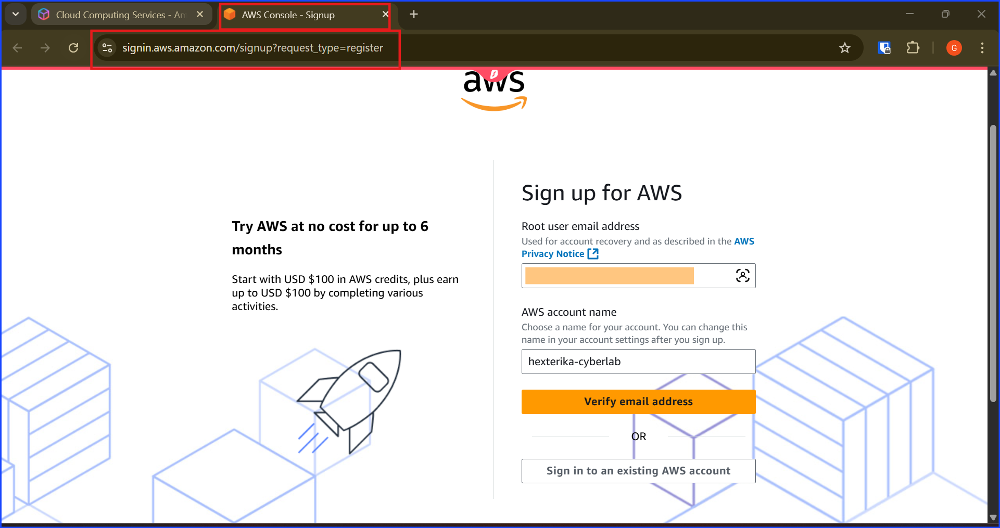

After verifying the email, I am facing with the create password here. On this page, you will be creating the password of the root user account in this step.

For someone who has no idea what is root user account, why not John Doe account, the short answer that isn't too distacted from the main content is it is the first and the most important account that every AWS user has. It will be the account that has the highest priority and can access every resources in our AWS account.

As shown in the screenshot below, AWS told me that my email address has been successfully verified. Then, I can move to the next step, creating root user password and then click "Continue (step 1 of 5)".

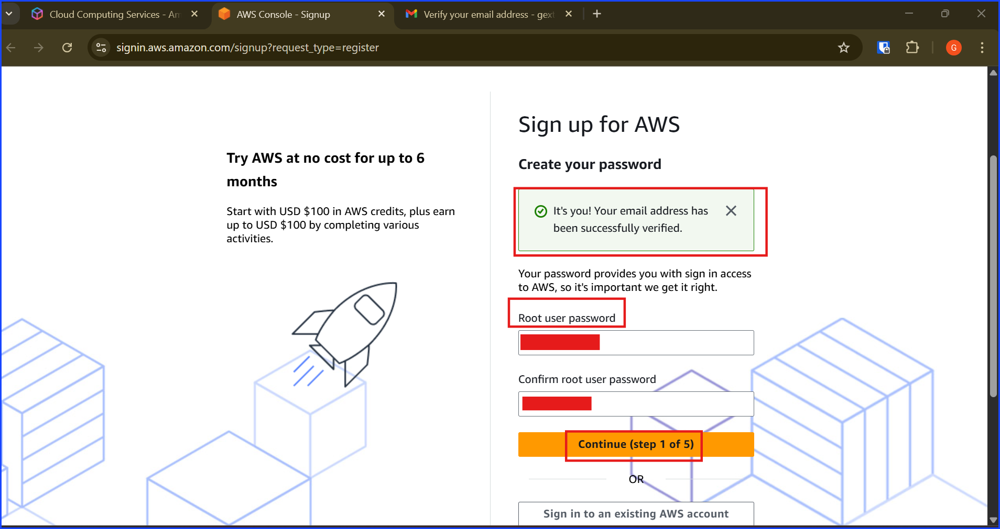

Now I am facing the sign up page. There are two plans, free and paid. Of course I am going to start with the free plan and upgrade later. However, before that, let's scroll down and take a look at the addtional details.

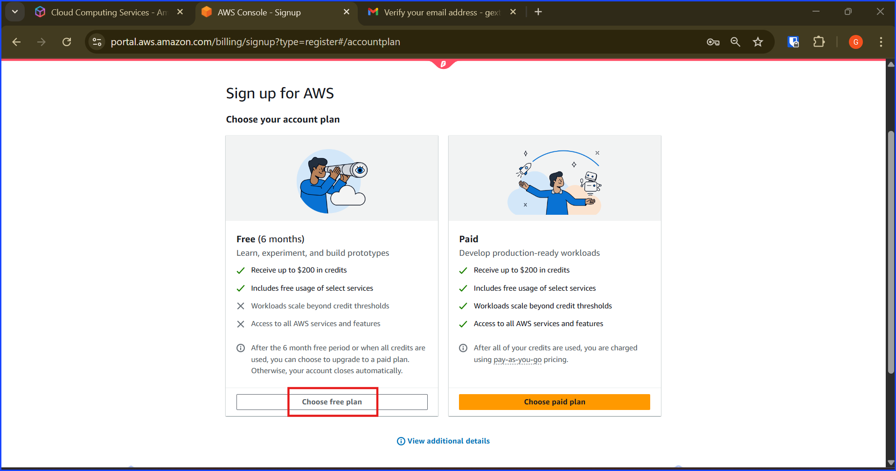

The additional details contains limitation of the free account plan. This is the new update that I really like. The last time I had trouble with controlling the payment due to me being an inexperience and had to pay for it.

This new limitation helps new and old clients be able to use free resources for free under limitation and without the risk of breaking the bank but it is temporary so the if you are going to use their resources in a serious way, then, it will be better to upgrade to the paid version later. Otherwise, you will have to keep rebuilding everything from scratch again and again.

In this setup guide of mine, I am aiming to make sure that I setup my billing correctly so once I choose to upgrade it to the paid version, I can do so easily without worrying that I will get an unexpected bill later.

You can take a look at the editional details in the screenshot below. This screenshot was taken at the time I am writing this walkthrough which is a snapshot in time of what AWS currently offers. I cannot predict their future changes in offer or policies.

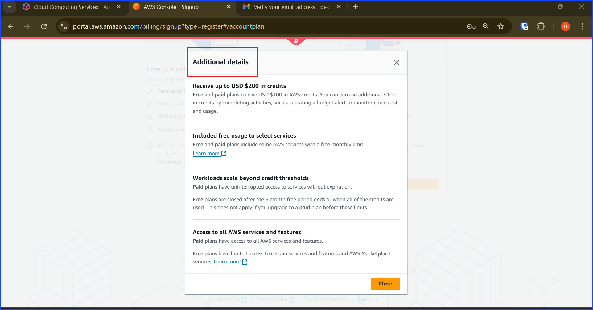

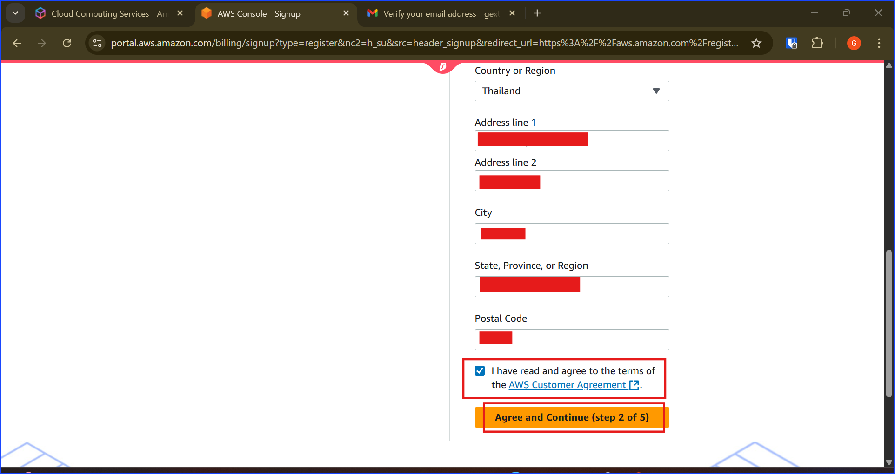

Looking at the contact information, there are two types, personal and business. I select both one at a time to see the differences. As you can see from the two images below, the only different is that the business has an additional field called "Organization Name".

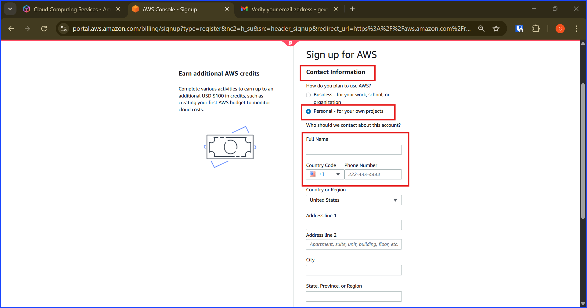

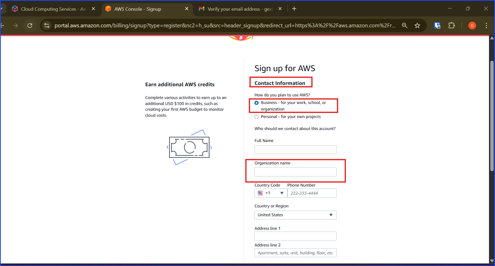

Now, I choose business because my goal is to set it up for my own business brand, Hexterika Cyberlab. Here you can see that I am start filling into the form with my business name "Hexterika Cyberlab".

Also, I need to use my real legal name here because it will be my billing address.

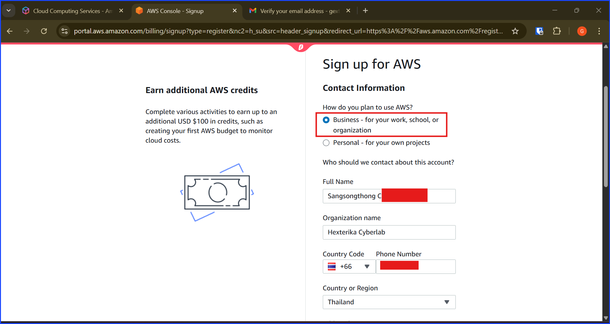

Next, I setup my billing info. Be aware that I need to use my real card. Enter payment method (use low-limit credit/debit if possible).

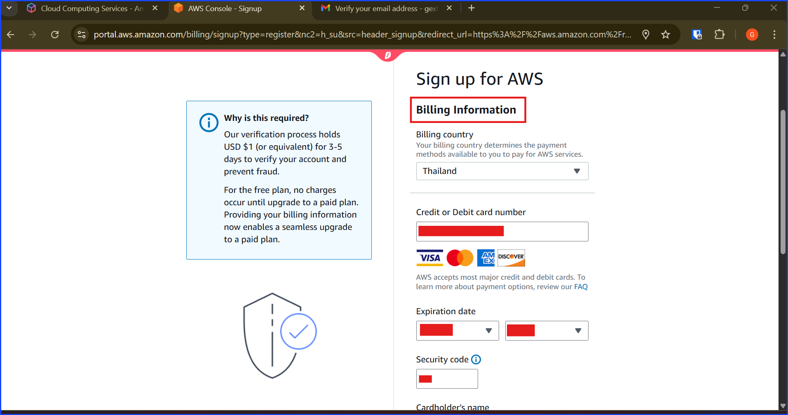

Then, clicked verify and continue to step 3 of 5.

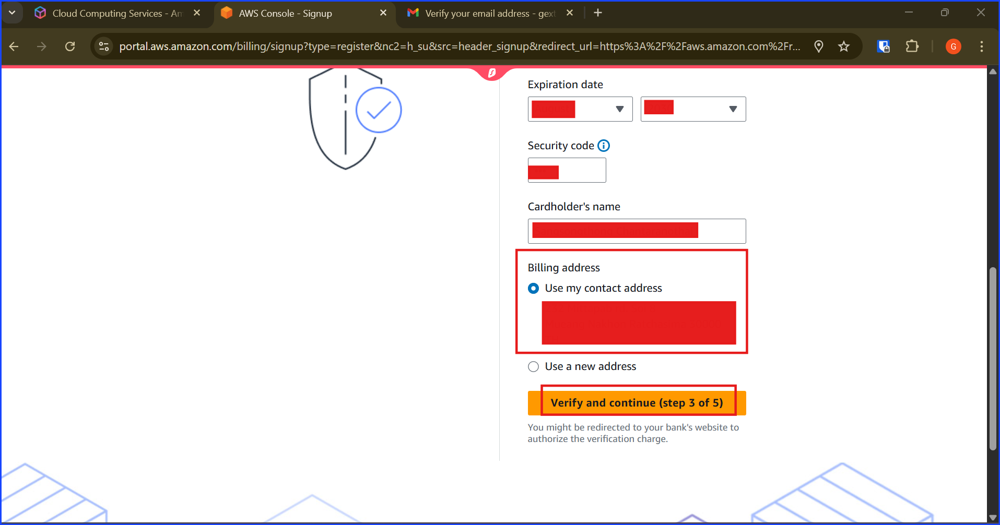

Now verify my identity, I just need to fill in my phone number and pick the verification method.

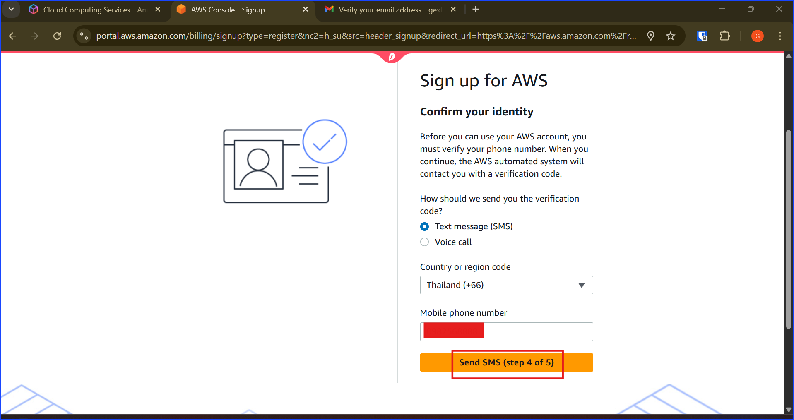

After I am done with the verification process, I am greeted with the below screenshot. This is the sign-up confirmation.

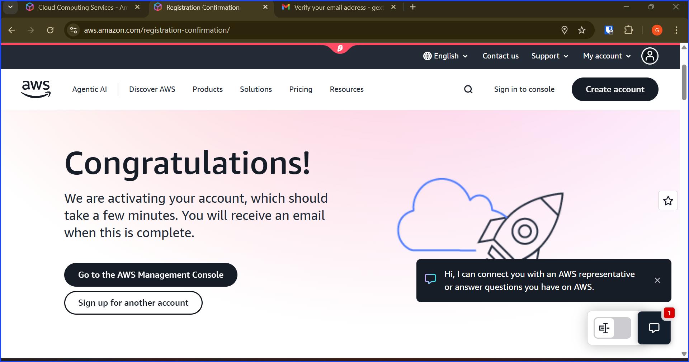

---

## 2. Setup MFA For The Root Account

After signing into the root account, on the console, I searched for IAM. There was a button to set the MFA so I set the MFA.

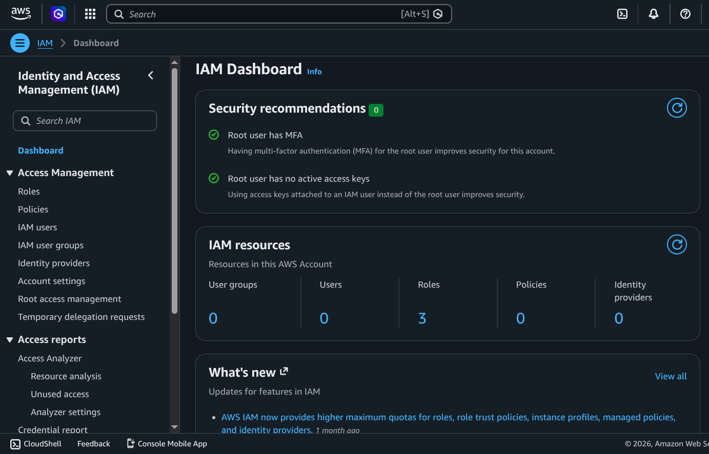

Then, I logged out and logged back in to verify that the MFA is set correctly. Noted that when I signed out, I had to sign in with the root email. At this point, there is no billing or other user setup yet.

## 2. First console sign-in and region

I sign in with the root email (no other users exist yet), then set the region to ***US East (N. Virginia)*** / ***us-east-1***. Not for "consistency" — for two concrete reasons:

1. New AWS features and updates land in ***us-east-1*** first.

2. Billing alarms can only be created in ***us-east-1***, even though the billing metric itself is global. This region choice is what makes the Walkthrough 02 billing alarm possible.

I am getting ready to set the billing alarm.

---
