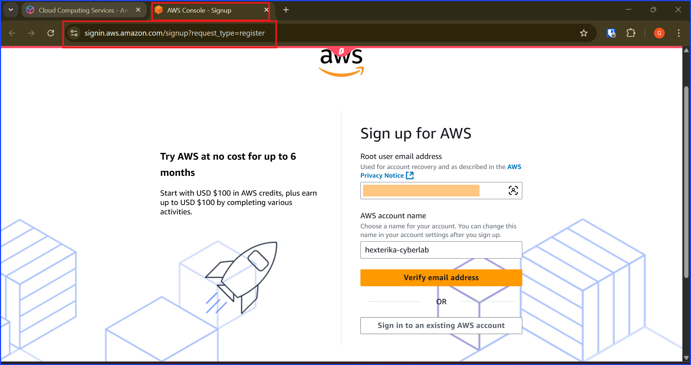

# 🧑‍💻 Walkthrough 1 – Day 0: AWS Lab Account Setup

## Objective

+ Set up a new AWS account correctly from the start

+ Secure the root user.

+ Put billing controls in place.

+ Create an IAM admin user for daily work.

This ensure no unintended charge will occur.

## Steps

### 1. Create AWS Lab Account

Here I am sitting in front of the AWS sign-up page. The red boxes shows that I am in the correct website, AWS Console signin page. In this situation, I am assuming that I don't already have an AWS account and I am about to sign up for my first account.

Let's take a look at this page, I have to mentally pick an email to use as my root user email and type it in. 

As you can see, I blurred my email for security reason, but I leave my brand "Hexterika Cyberlab" visible.

**Important Note:** Pick the email that you can receive inbox email verification because the system will ask to send email verification OTP there.

Take a look at the below screenshot so you know which page I have been talking about.

After verifying the email, I am facing with the create password here. On this page, you will be creating the password of the root user account in this step.

For someone who has no idea what is root user account, why not John Doe account, the short answer that isn't too distacted from the main content is it is the first and the most important account that every AWS user has. It will be the account that has the highest priority and can access every resources in our AWS account.

As shown in the screenshot below, AWS told me that my email address has been successfully verified. Then, I can move to the next step, creating root user password and then click "Continue (step 1 of 5)".

Enter payment method (use low-limit credit/debit if possible).

Region: set to US East (N. Virginia) (us-east-1) for consistency.

### 2. Secure Root Account

Log in as Root User (email + password).

Enable MFA (Authenticator app).

Store recovery codes + credentials in your password manager.

Do not create Root access keys.

### 3. Billing Control Setup (Critical)

a) Enable Billing Preferences

In Billing Preferences:

✅ Receive Billing Alerts.

✅ Receive Free Tier Usage Alerts.

b) Create AWS Budgets

Go to Billing → Budgets → Create Budget.

Choose Cost Budget.

Monthly limit: $5 USD.

Add 2 alerts:

80% ($4) → “Warning.”

100% ($5) → “Stop! Check account.”

Email alerts to:

Subscription email (root).

Backup inbox you always check.

c) Create CloudWatch Billing Alarm

Go to CloudWatch → Alarms → Billing.

Condition: “EstimatedCharges > $5.”

Action: Send notification to SNS topic → Email subscription.

Subscribe your main inbox.

📌 Now you’ll get multiple alerts if billing exceeds $5.

### 4. Create IAM Admin User

Go to IAM Console.

Create group: Administrators.

Attach AWS managed policy: AdministratorAccess.

Create new user: lab-admin.

Access type: Console + Programmatic.

Temporary password, force reset at login.

Add lab-admin to Administrators group.

### 5. Switch to IAM Admin

Log out Root.

Log in as lab-admin.

Verify you can access services.

Root account should now be used only for billing/security tasks.

Validation

Root account MFA enabled.

Billing budgets + alarms active.

IAM lab-admin user exists and works.

Root not used for daily tasks.

Reflection

This setup ensures no billing surprises and root security from Day 0.

With lab-admin, I can now start IAM labs without fear of uncontrolled charges.

---
