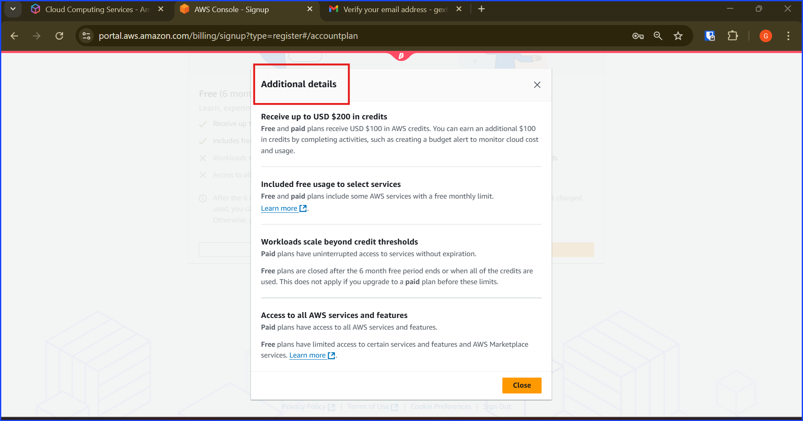

# 🧑‍💻 Walkthrough 1 – Day 0: AWS Lab Account Setup

## Objective

+ Set up a new AWS account correctly from the start

+ Secure the root user.

+ Put billing controls in place.

+ Create an IAM admin user for daily work.

This ensure no unintended charge will occur.

## Steps

### 1. Create AWS Lab Account

Here I am sitting in front of the AWS sign-up page. The red boxes shows that I am in the correct website, AWS Console signin page. In this situation, I am assuming that I don't already have an AWS account and I am about to sign up for my first account.

Let's take a look at this page, I have to mentally pick an email to use as my root user email and type it in.

As you can see, I blurred my email for security reason, but I leave my brand "Hexterika Cyberlab" visible.

**Important Note:** Pick the email that you can receive inbox email verification because the system will ask to send email verification OTP there.

Take a look at the below screenshot so you know which page I have been talking about.

After verifying the email, I am facing with the create password here. On this page, you will be creating the password of the root user account in this step.

For someone who has no idea what is root user account, why not John Doe account, the short answer that isn't too distacted from the main content is it is the first and the most important account that every AWS user has. It will be the account that has the highest priority and can access every resources in our AWS account.

As shown in the screenshot below, AWS told me that my email address has been successfully verified. Then, I can move to the next step, creating root user password and then click "Continue (step 1 of 5)".

Now I am facing the sign up page. There are two plans, free and paid. Of course I am going to start with the free plan and upgrade later. However, before that, let's scroll down and take a look at the addtional details.

The additional details contains limitation of the free account plan. This is the new update that I really like. The last time I had trouble with controlling the payment due to me being an inexperience and had to pay for it. 

This new limitation helps new and old clients be able to use free resources for free under limitation and without the risk of breaking the bank but it is temporary so the if you are going to use their resources in a serious way, then, it will be better to upgrade to the paid version later. Otherwise, you will have to keep rebuilding everything from scratch again and again.

In this setup guide of mine, I am aiming to make sure that I setup my billing correctly so once I choose to upgrade it to the paid version, I can do so easily without worrying that I will get an unexpected bill later.

You can take a look at the editional details in the screenshot below. This screenshot was taken at the time I am writing this walkthrough which is a snapshot in time of what AWS currently offers. I cannot predict their future changes in offer or policies.

Looking at the contact information, there are two types, personal and business. I select both one at a time to see the differences. As you can see from the two images below, the only different is that the business has an additional field called "Organization Name".

Now, I choose business because my goal is to set it up for my own business brand, Hexterika Cyberlab. Here you can see that I am start filling into the form with my business name "Hexterika Cyberlab".

Also, I need to use my real legal name here because it will be my billing address.

Next, I setup my billing info. Be aware that I need to use my real card. Enter payment method (use low-limit credit/debit if possible).

Then, clicked verify and continue to step 3 of 5.

Now verify my identity, I just need to fill in my phone number and pick the verification method.

After I am done with the verification process, I am greeted with the below screenshot. Next, I will log into the console.

Then, I paused for a few days. Once I come back, I went to the official aws console sign-in page. Choose sign-in with root user email because I haven't set my other users.

Region: set to US East (N. Virginia) (us-east-1) for consistency. --> Nope. Not for consistency. Set here to be compatitble for lab documents and to get access to all features and update the fastest.

I did this by going to the top right and picked ***us-east-1***.

### 2. Secure Root Account

Log in as Root User (email + password).

Enable MFA (Authenticator app).

Store recovery codes + credentials in your password manager.

Do not create Root access keys.

### 3. Billing Control Setup (Critical)

a) Enable Billing Preferences

In Billing Preferences:

✅ Receive Billing Alerts.

✅ Receive Free Tier Usage Alerts.

b) Create AWS Budgets

Go to Billing → Budgets → Create Budget.

Choose Cost Budget.

Monthly limit: $5 USD.

Add 2 alerts:

80% ($4) → “Warning.”

100% ($5) → “Stop! Check account.”

Email alerts to:

Subscription email (root).

Backup inbox you always check.

c) Create CloudWatch Billing Alarm

Go to CloudWatch → Alarms → Billing.

Condition: “EstimatedCharges > $5.”

Action: Send notification to SNS topic → Email subscription.

Subscribe your main inbox.

📌 Now you’ll get multiple alerts if billing exceeds $5.

Raw Note Dump:

Step 5a – Billing Controls (Raw Full Notes Dump)
📌 Billing Preferences

Enabled AWS Free Tier usage alerts → so I know if free usage is being burned.

Enabled CloudWatch billing alerts here too → important because Budgets and CloudWatch alarms work differently (Budgets is billing-only, CloudWatch integrates with monitoring).

Optionally, you can add an alternate email. Why? If your primary email inbox gets buried, the secondary inbox gives redundancy.

I decided to skip the optional email for now because I’m already setting up SNS alerts in CloudWatch later.

👉 Why not skip Billing Preferences? Because without this, IAM users can’t see billing, and root will be the only one notified. That’s bad practice — I want billing visibility extended to admins.

📌 Budgets

Zero Spend Budget vs Monthly Cost Budget

Zero Spend: triggers if I spend more than $0.01. Too strict — even Free Tier legitimate usage (like $0.10) would spam me.

Monthly Cost Budget ($5): gives freedom to test small services, but still safe.

👉 Why $5?

Enough to cover minor charges (data transfer, storage) without panic.

Still low enough to stop surprises (like forgetting an EC2 instance running).

Chosen over $10+ because this lab is not production — $5 makes me cautious.

Notifications:

At 85% ($4.25) → early warning.

At 100% ($5.00) → critical stop.

At forecasted 100% → predictive alert, even before reaching the threshold.

👉 Why not only 100%? Because that’s too late. I need an early-warning system.

📌 CloudWatch Billing Alarm (SNS)

Redundancy: Budgets → emails (can be delayed), CloudWatch → SNS notifications (faster, more reliable, can fan out to SMS, Lambda, etc.).

Metric: EstimatedCharges (USD) (this is global, not per-region, and covers the whole account).

Condition: Greater/Equal (≥ $5)

Greater ( > ) would trigger only at $5.01.

Greater/Equal ( ≥ ) is better: I get notified right at $5.00.

Period: default 6h (fine — AWS billing metrics only update a few times a day anyway).

Datapoints to alarm: 1/1 (trigger as soon as condition is met).

👉 Why not add EC2/S3/system metrics? Because this is a global billing alarm. Service-specific metrics are useful later for performance monitoring, not billing safety.

SNS setup:

Created BillingAlertsTopic.

Added email endpoint → must confirm via AWS email.

Chose subscription email separate from root inbox → prevents root mailbox overload.

📌 Why Do Both Budgets and CloudWatch?

AWS is redundant by design. If I only set up Budgets, there’s a risk the alert arrives late. If I only set CloudWatch, I miss the predictive “forecast” that Budgets gives.

By combining:

Budgets = early warning + predictive + cost trend analysis.

CloudWatch = strict alarm + SNS delivery redundancy.

This prevents a repeat of my 2023 screw-up, where I got billing surprises because I had no layered protection.

📌 End of Step 5a

At this point, I have:

Billing Preferences enabled (root alerts + CloudWatch integration).

Monthly Budget at $5 (with multiple alert thresholds).

CloudWatch Billing Alarm with SNS ($5 threshold, email notification).

✅ This completes Step 5a.
I now have three independent safety nets around billing.

⚠️ Extra reflections I had while working:

Billing alarms only exist in us-east-1 (N. Virginia). That’s why I had to stay in that region even though I live in Thailand and will move to Georgia. The metric itself is global, but the alarms only work from that region.

At first, I considered Zero Spend Budget to be the most secure, but it would make the lab experience miserable (every tiny Free Tier usage would fire). So I learned that “security at all cost” can backfire if it stops you from learning.

By adding both Budgets and CloudWatch, I now also have something to show in my portfolio: I understand layered defenses in AWS billing, not just IAM.

### 4. Create IAM Admin User

Go to IAM Console.

Create group: Administrators.

Attach AWS managed policy: AdministratorAccess.

Create new user: lab-admin.

Access type: Console + Programmatic.

Temporary password, force reset at login.

Add lab-admin to Administrators group.

### 5. Switch to IAM Admin

Log out Root.

Log in as lab-admin.

Verify you can access services.

Root account should now be used only for billing/security tasks.

Validation

Root account MFA enabled.

Billing budgets + alarms active.

IAM lab-admin user exists and works.

Root not used for daily tasks.

Reflection

This setup ensures no billing surprises and root security from Day 0.

With lab-admin, I can now start IAM labs without fear of uncontrolled charges.

---
